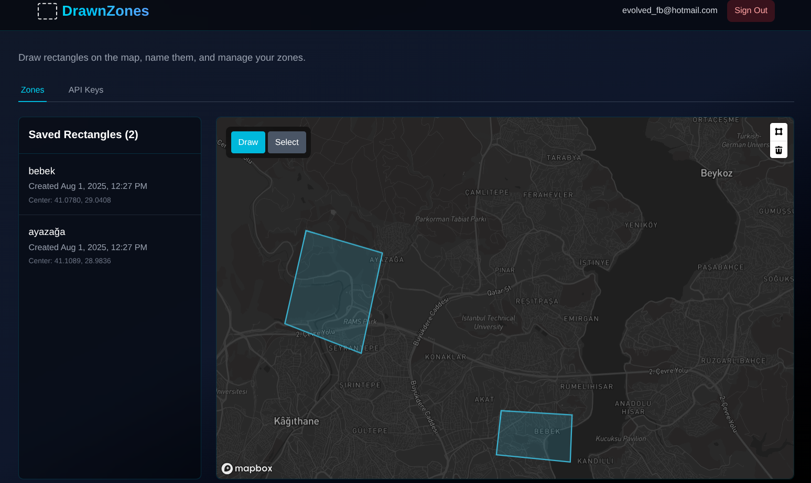

# DrawnZones - Interactive Map Rectangle Drawing App

DrawnZone was developed to show my skills for Full Stack Engineer Position that I aplied for.

## 📸 Screenshots



_Main dashboard showing interactive map with drawn rectangles and management interface_

## 🎥 Demo Video

[](https://youtu.be/NadwhUsrrDU)

_Watch a demo of DrawnZones in action - Click the thumbnail to view the video_

## 🎯 What is DrawZones

DrawnZones enables users to create, manage, and visualize c rectangles on Mapbox.

It also provides a developer API, enabling users to fetch their own rectangles they created.

## ✨ Features

- Draw rectangles on a Mapbox
- Name, save drawn rectangles
- View all saved rectangles on the map
- Magic link authentication system for secure access
- Developer-friendly API key system

## 🚀 Quick Start

### Prerequisites

- Docker

1. **Clone the repository**

   ```bash
   git clone https://github.com/fcendesu/drawn-zones.git
   cd drawn-zones
   ```

2. **Create Environment File (Works on Arch Linux)**

   ```bash
   # Replace your Mapbox public key
    cp .env.example .env
   ```

3. **Start the application (Works on Arch Linux, Might try docker-compose)**

   ```bash
   docker compose up -d
   ```

4. **Access the application**

   - Frontend: http://localhost:3000
   - Backend API: http://localhost:8000
   - MailHog: http://localhost:8025

5. **Sign In Process**
   - Enter your email
   - Check MailHog at http://localhost:8025 for the magic link email
   - Click the magic link in the email to automatically sign in

## 🏗️ Architecture

#### Tech Stack:

- **Frontend**: Next.js 15 with TypeScript - my mostly used framework after Expo
- **Backend**: Django 5 with DRF
- **Database**: PostgreSQL
- **Email**: MailHog for local email testing server - will be replaced with production email service in deployment

#### Key Decisions:

- **Authentication**: This is my favoriute authentication way. I implemented magic link authentication system from scratch. Users receive magic links that automatically authenticate them without passwords.
- **Map Integration**: Mapbox GL was chosen by the task organizer.
- **API Key Management**: Implemented a developer-friendly API key system allowing users to generate and manage their own keys.
